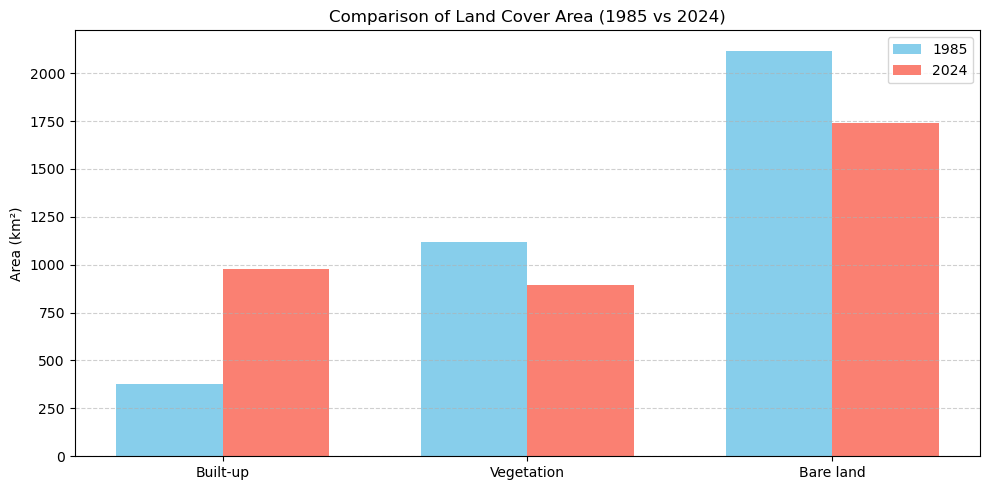
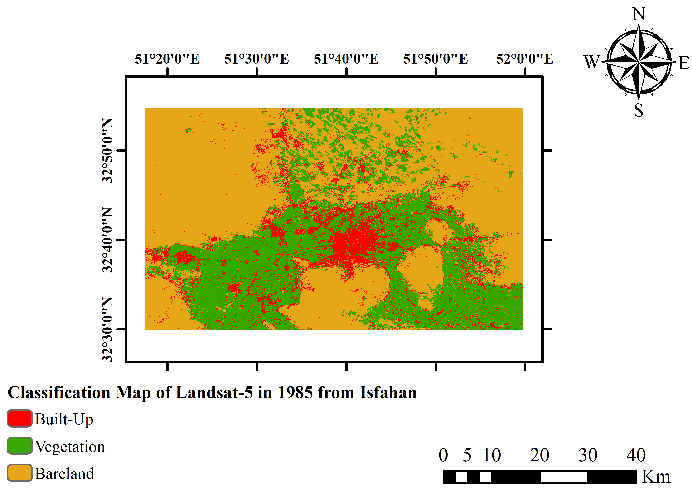
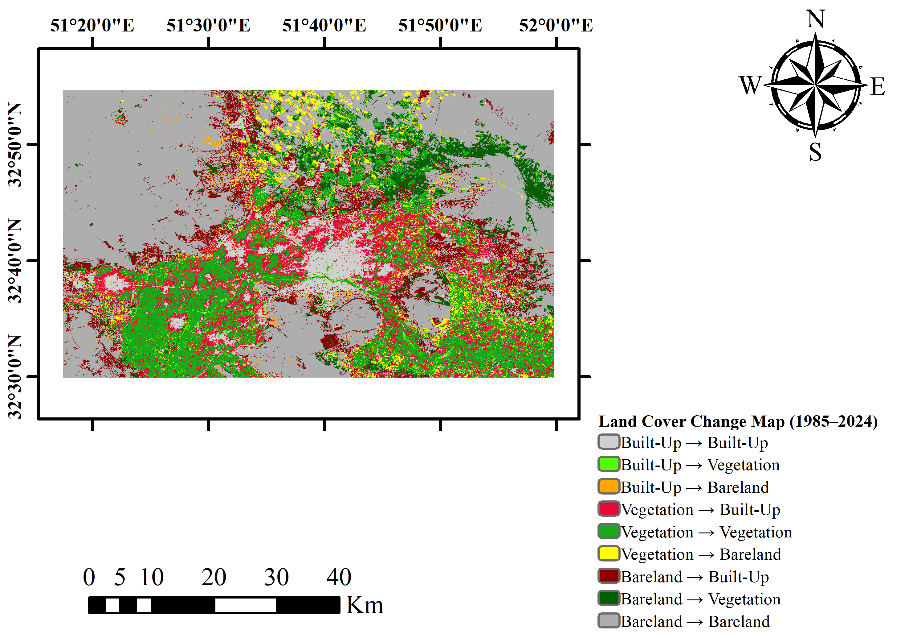
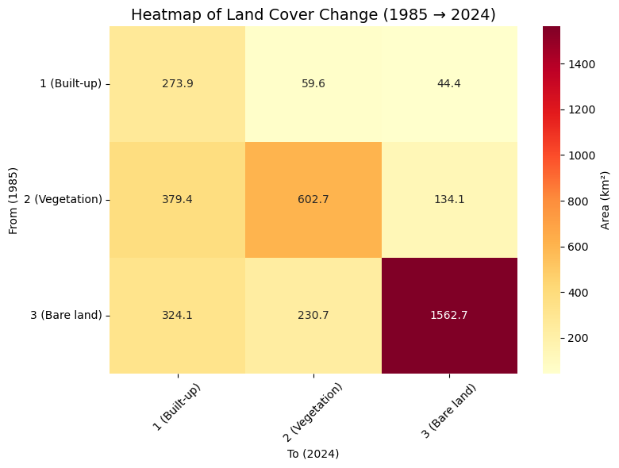

# Isfahan Urban Expansion Mapping with Landsat and Machine Learning

A documented remote-sensing workflow for mapping land-cover change and urban expansion in Isfahan, Iran, between 1985 and 2024.

`Python` · `Google Earth Engine` · `Landsat` · `NDVI/NDBI` · `SVM` · `Random Forest` · `Rasterio` · `GeoPandas`

## Key results

- Built-up area increased by **599.51 km²** between 1985 and 2024.
- SVM reached **97.4% overall accuracy** in 1985 and **95.9%** in 2024.
- Approximately **379 km²** changed from vegetation to built-up land.
- Approximately **324 km²** changed from bare land to built-up land.


## Project overview

This project examines long-term land-cover change across the Isfahan metropolitan area using:

- Landsat 5 TM imagery acquired on **2 August 1985**
- Landsat 9 OLI-2 imagery acquired on **5 August 2024**
- Six surface-reflectance bands plus NDVI and NDBI
- Three land-cover classes: Built-up, Vegetation, and Bare land
- Support Vector Machine and Random Forest classification
- Pixel-based post-classification change detection

The workflow was developed as part of the **Earth Observation Advanced** course at Politecnico di Milano.

## Input imagery

| Year | Sensor | Acquisition date | Cloud cover |
|---:|---|---|---:|
| 1985 | Landsat 5 TM | 1985-08-02 | 0% |
| 2024 | Landsat 9 OLI-2 | 2024-08-05 | 6.33% |

The Google Earth Engine script prints the selected Landsat product ID, acquisition date, cloud cover, and output band order to the Console.

Each exported raster contains eight bands in this order:

```text
Blue, Green, Red, NIR, SWIR1, SWIR2, NDVI, NDBI
```

## Objectives

- Produce land-cover maps for 1985 and 2024.
- Compare SVM and Random Forest performance.
- Quantify class-wise area change.
- Build a 3 × 3 land-cover transition matrix.
- Map the spatial pattern of urban expansion.

## Workflow

1. Select Landsat scenes in Google Earth Engine.
2. Apply surface-reflectance scaling.
3. Calculate NDVI and NDBI.
4. Prepare reference polygons for three land-cover classes.
5. Extract mean spectral and index values for each polygon.
6. Split the reference dataset into training and validation subsets.
7. Train and evaluate Random Forest and RBF-kernel SVM models.
8. Apply the selected SVM model to the full raster.
9. Compare the 1985 and 2024 classified rasters pixel by pixel.
10. Calculate area change and transition matrices.
11. Produce maps, charts, and a transition heatmap.

## Land-cover classes

| Code | Class |
|---:|---|
| 1 | Built-up |
| 2 | Vegetation |
| 3 | Bare land |

## Classification results

| Year | Classifier | Overall accuracy | Kappa |
|---:|---|---:|---:|
| 1985 | SVM | 97.4% | 0.961 |
| 1985 | Random Forest | 95.7% | 0.935 |
| 2024 | SVM | 95.9% | 0.933 |
| 2024 | Random Forest | 93.4% | 0.890 |

SVM achieved the highest overall accuracy in both years and was used for the final land-cover maps and change analysis.

## Land-cover area change

| Class | 1985 area (km²) | 2024 area (km²) | Change (km²) | Change |
|---|---:|---:|---:|---:|
| Built-up | 377.87 | 977.38 | +599.51 | +158.7% |
| Vegetation | 1116.26 | 893.01 | -223.25 | -20.0% |
| Bare land | 2117.48 | 1741.22 | -376.26 | -17.8% |



## Land-cover maps

<table>
  <tr>
    <td align="center"><strong>1985</strong></td>
    <td align="center"><strong>2024</strong></td>
  </tr>
  <tr>
    <td></td>
    <td></td>
  </tr>
</table>

## Change detection



The largest transitions were:

- Vegetation → Built-up: approximately **379 km²**
- Bare land → Built-up: approximately **324 km²**
- Bare land → Bare land: approximately **1563 km²**



## Repository structure

```text
Isfahan-urban-expansion-landsat-ml/
├── data/
│   ├── imagery/                 # Large Landsat raster inputs; excluded from Git
│   ├── study_area/
│   └── training/
│       ├── 1985/
│       └── 2024/
├── gee/
│   └── landsat_preprocessing.js
├── images/
├── models/                      # Generated model files; excluded from Git
│   ├── 1985/
│   └── 2024/
├── report/
├── results/
│   ├── metrics/
│   ├── rasters/
│   └── tables/
├── src/
│   ├── year_1985/
│   ├── year_2024/
│   └── change_detection/
├── .gitignore
├── README.md
└── requirements.txt
```

## Setup

Clone the repository and install the required Python packages:

```powershell
git clone https://github.com/alimoeinkhah/Isfahan-urban-expansion-landsat-ml.git
cd Isfahan-urban-expansion-landsat-ml

python -m venv .venv
.\.venv\Scripts\Activate.ps1
pip install -r requirements.txt
```

## Preparing the input rasters

The original Landsat input rasters are larger than GitHub's normal file-size limit and are excluded through `.gitignore`.

Recreate them with:

```text
gee/landsat_preprocessing.js
```

Alternatively, place prepared rasters in `data/imagery/` using these exact filenames:

```text
Esfahan_L5_1985_with_NDVI_NDBI.tif
Esfahan_L9_2024_with_NDVI_NDBI.tif
```

## Running the classification workflow

### 1985

```powershell
python src/year_1985/02_inspect_inputs.py
python src/year_1985/03_inspect_raster_bands.py
python src/year_1985/04_extract_zonal_statistics.py
python src/year_1985/05_train_and_evaluate_classifiers.py
python src/year_1985/06_apply_svm_classifier.py
```

### 2024

```powershell
python src/year_2024/02_inspect_inputs.py
python src/year_2024/03_inspect_raster_bands.py
python src/year_2024/04_extract_zonal_statistics.py
python src/year_2024/05_train_and_evaluate_classifiers.py
python src/year_2024/06_apply_svm_classifier.py
```

The `01_convert_kmz_training_data.py` scripts are only required when starting from the original class-specific KMZ reference polygons. Converted GeoJSON and CSV files are already included.

## Running change detection

```powershell
python src/change_detection/01_calculate_area_change.py
python src/change_detection/02_build_transition_matrices.py
python src/change_detection/03_create_change_map.py
python src/change_detection/04_plot_transition_heatmap.py
```

## Main outputs

- Classified rasters for 1985 and 2024
- Overall accuracy and Kappa statistics
- Confusion matrices
- Land-cover area comparison
- Pixel, area, and percentage transition matrices
- Nine-class land-cover change raster
- Transition matrix heatmap

## Limitations

- The analysis compares two dates rather than a continuous annual time series.
- Landsat's 30 m spatial resolution cannot resolve narrow streets or very small agricultural plots.
- Reference samples were prepared through visual interpretation and may contain positional or labeling uncertainty.
- Seasonal variation was reduced by using summer imagery for both dates, but the acquisition dates are not identical.

## Reports

- [Project report](report/isfahan_urban_expansion_report.pdf)
- [Project presentation](report/isfahan_urban_expansion_presentation.pptx)

## Author

**Ali Moeinkhah**  
Geospatial and Remote Sensing Project  
Politecnico di Milano

### Project context

Developed for the *Earth Observation Advanced* course, Academic Year 2024–2025.
